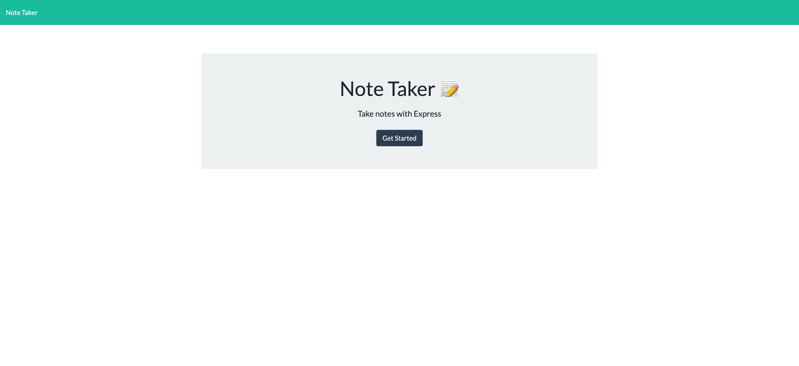
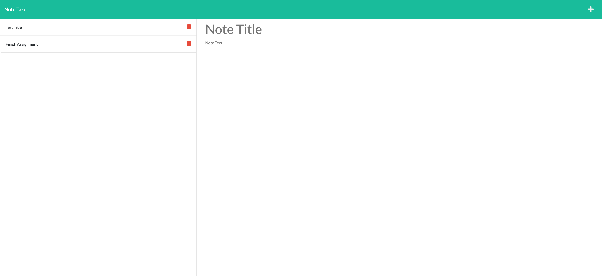

# NoteTaker


A small business owner wants to be able to write and save notes to organize their thoughts and keep track of tasks that need to be completed. While this application is intended for businesses, it is also a perfect anyone who needs to jot down some reminders!

# Criteria 

```
GIVEN a note-taking application
WHEN I open the Note Taker
THEN I am presented with a landing page with a link to a notes page
WHEN I click on the link to the notes page
THEN I am presented with a page with existing notes listed in the left-hand column, plus empty fields to enter a new note title and the note’s text in the right-hand column
WHEN I enter a new note title and the note’s text
THEN a Save icon appears in the navigation at the top of the page
WHEN I click on the Save icon
THEN the new note I have entered is saved and appears in the left-hand column with the other existing notes
WHEN I click on an existing note in the list in the left-hand column
THEN that note appears in the right-hand column
WHEN I click on the Write icon in the navigation at the top of the page
THEN I am presented with empty fields to enter a new note title and the note’s text in the right-hand column
```

# Screenshot




# Deployed Site

[Heroku Link](https://jot-it09.herokuapp.com/notes)

# Other Details

- Used in-class activities and chat resources to complete assignment.

- Additionally, worked with Brooke Jones to complete assignemnt.

- Let's Connect on GitHub! [mlh19](https://www.github.com/mlh19)

- Email Me! [ml.hoover@yahoo.com](mailto:ml.hoover@yahoo.com)

